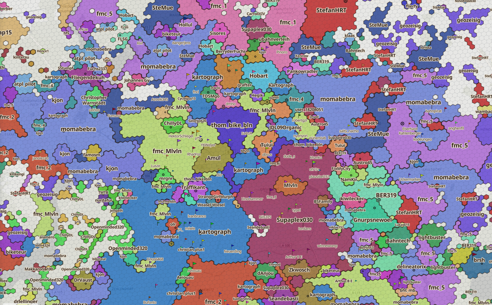

# OSM Landgewinn

Interaktive Karte der aktivsten OpenStreetMap-Mapper:innen in einem Gebiet:

**[supaplexosm.github.io/osm-land-gain](https://supaplexosm.github.io/osm-land-gain/)**

Die Karte zeigt, wer zuletzt die OSM-Daten in einem Hexagon-Gitter (H3) bearbeitet hat. Du kannst nach Themen filtern (Straßen, Gebäude, Landuse, POIs, Stadtmöbel, OSM-Notes, StreetComplete) sowie zwischen Ansichten nach Usern, Mapping-Aktivitäten und Anzahl der OSM-Objekte wählen. Für die Vergangenheit können ebenfalls Daten angezeigt werden: Entweder pro Quartal aus den vergangenen drei Jahren, oder ältere Jahresstände bis zu den Anfängen von OSM.

**Methodik:** Die Berechnung basiert auf der jeweils letzten Bearbeiter:in, die ein Objekt (getaggte Nodes, Linien oder Flächen) in OSM bearbeitet hat. Diese Bearbeitungen werden pro Gitterzelle gezählt und in einen Indexwert umgerechnet. Der Index gewichtet jüngere Edits stärker, zeigt also vor allem gegenwärtige Mapping-Aktivitäten. Für die Darstellung der farbigen User-Gebiete findet eine Glättung mit Nachbarzellen statt, um für möglichst zusammenhängende Gebiete darstellen zu können, wer vor Ort am aktivsten mappt. "Fähnchen" markieren lokale Aktivitätszentren von Mapper:innen, die an dieser Stelle kein eigenes "Usergebiet" haben. Die „Haifischzähne“ zeigen, wo sich Usergebiete gegenüber dem Stand drei Monate zuvor verschoben haben.

Die Anwendung ist ein Vibe-Coding-Projekt; der Code entstand also überwiegend im Dialog mit LLM.



## Andere Städte aufsetzen

Die Webmap läuft über **GitHub Pages** (Branch `gh-pages`). Einmal pro Quartal holt die Action den aktuellen Geofabrik-Extract und erzeugt einen neuen Snapshot. Historische Stände kannst du **lokal aus der OSM-History (OSH)** vorberechnen und einmalig auf `gh-pages` legen – danach braucht die Action für neue Quartale nur noch die Geofabrik-Downloads. Historie ist optional: Die Karte funktioniert auch mit einem oder wenigen aktuellen Quartalen.

### Gebiet definieren

In `pipeline/config.py` das Profil `prod` (oder ein eigenes) anpassen:

1. `Source` mit `latest_url` und `history_url` der Geofabrik-Internal-Extracts deiner Region
2. Eine oder mehrere BBOXen `(west, south, east, north)` – nur dieser Ausschnitt wird ausgewertet
3. Optional `dev` mit einer kleinen Test-BBOX zum schnellen Durchprobieren

### Datenquelle und OSM-Zugang

Die Pipeline lädt den Internal Extract mit OSM-Login. Lokal:

```bash
python -m pipeline.geofabrik --write-credentials
# fragt OSM-Benutzername + Passwort ab (wie auf openstreetmap.org)
# und schreibt sie nach pipeline/_cache/geofabrik-credentials.json (gitignored)
```

Für automatische Quartals-Updates in der Action: Repository-Secrets `OSM_USER` und `OSM_PASSWORD` (Settings → Secrets and variables → Actions). Die Secrets bleiben versteckt und landen nicht im Code. Alternativ Snapshots immer lokal erzeugen und `gh-pages` selbst aktualisieren – dann brauchst du keine Secrets, solltest den geplanten Workflow aber deaktivieren (sonst scheitert er am Quartals-Cron ohne Login).

### Lokal erzeugen und ansehen

```bash
python3 -m venv .venv
source .venv/bin/activate
pip install -r pipeline/requirements.txt
python -m pipeline.geofabrik --write-credentials

# Kleiner Testausschnitt (Profil dev)
python -m pipeline.run --profile dev --download --snapshot 2026-06-21

# Mehrere Stände aus History (OSH); ohne --dates: letzte 12 Quartale
python -m pipeline.run --profile prod --history --dates 2025-12-21,2026-03-21,2026-06-21

# Produktion Berlin+Umland: letzte 12 Quartale aus History
python -m pipeline.run --profile prod --history

cd web && npm install && npm run dev
```

Pro Stichtag landet unter `web/public/data/YYYY-MM-DD/` u. a. `cells.pmtiles` (Vektor-Kacheln für MapLibre), dazu Metadaten und Sidecars. `web/public/data/snapshots.json` listet die Stände für die Zeitleiste. PBFs/OSH bleiben in `pipeline/_cache/` (gitignored).

Zusätzlich lädt die Auswertung einmal pro Lauf den Notes-Dump (`planet-notes-latest.osn.bz2`, ca. 420 MB) und streamt den Changeset-Dump (`changesets-latest.osm.bz2`, ca. 8 GB, nicht auf die Platte). Daraus entstehen die Filter für OSM-Notes und StreetComplete. `--skip-planet` überspringt sie (sinnvoll beim lokalen Testen, dann fehlen Notes/StreetComplete); `--refresh-planet` holt sie neu.

Damit die Karte schnell erscheint, ist ein Stichtag auf mehrere Dateien verteilt. Auf dem kritischen Pfad liegen nur die ersten fünf: rund 1,3 MB fest plus die Kacheln des sichtbaren Ausschnitts. Alles Weitere wird nachgeladen.

| Datei | Inhalt |
| --- | --- |
| `cells.pmtiles` | Alle Hexagone mit ihren Kennzahlen; daraus wird gezeichnet |
| `cells.json` | Metadaten, Aktivitätszentren, Farbtabelle |
| `overlays.json.gz` | Fertig berechnete Usergebiete |
| `fronts.json.gz` | Frontabschnitte für die Haifischzähne („wer sich wohin ausbreitet“) |
| `users.json.gz` | Namen, Punkte und Schwerpunkte je Mapper:in |
| `cells.bin.gz` | Top-User je Hexagon; wird im Worker nachgeladen und füllt nur die Panels |
| `scalars.bin.gz` | Kennzahlen je Hexagon; nur die Pipeline liest sie |

Unter den Hexagonen liegt eine dezente [OpenFreeMap](https://openfreemap.org)-Basemap.

### Live bringen (GitHub Pages)

1. Repo forken oder klonen, Gebiet in `config.py` setzen, Frontend bei Bedarf anpassen
2. Secrets setzen **oder** manuell deployen (siehe oben)
3. Erste Daten lokal erzeugen (mindestens ein Quartal; optional History-Jahre)
4. Erste Veröffentlichung: Snapshot-Ordner unter `web/public/data/` liegen absichtlich nicht im Branch `main` (gitignored). App **und** Daten gehören auf **`gh-pages`**, von dem GitHub Pages ausliefert. Lokal `cd web && npm run build` – unter `web/dist/` liegt die gebaute Seite inkl. kopiertem `data/`. Diesen Inhalt einmalig als Branch `gh-pages` veröffentlichen. Ohne diesen Schritt hat die Live-Seite keine Kacheln – und die Action kann beim nächsten Quartal keine alten Snapshots von `gh-pages` zurückholen, bevor sie einen neuen erzeugt.
5. Workflow *Update OSM Land Gain* aktiv lassen (oder bei rein manuellem Betrieb deaktivieren)

### Quartals-Stände

**Datenstichtag** ist jeweils der **21.** März, Juni, September und Dezember. Die GitHub Action läuft am **22.** um 6:20 (Europe/Berlin), wenn der Extract des 21. typischerweise online ist. Anzeige:

- 21. März → Frühling $Jahr
- 21. Juni → Sommer $Jahr
- 21. September → Herbst $Jahr
- 21. Dezember → Winter $Jahr

Die letzten **12 Quartale** bleiben auf der Zeitleiste; ältere **21.-Dezember**-Ordner bleiben als Jahresgeschichte. Andere Quartale außerhalb des Fensters werden beim Manifest-Schreiben entfernt. Das Archiv liegt nur auf `gh-pages`; die Action holt bestehende Ordner vor jedem Lauf zurück.

Manueller Action-Lauf (`workflow_dispatch`) published nur App + Format-Upgrade der vorhandenen Stände (kein Geofabrik-Download). Ein neuer Snapshot entsteht nur am Quartals-Pipeline-Tag (22.).

### Wartung (optional)

Nur die Vektorkacheln aus vorhandenen Binärdaten neu bauen (ohne PBF/Neuauswertung), z. B. nach Zoom-Änderungen:

```bash
python -m pipeline.run --tiles-only --snapshot 2026-06-21
```

Ältere Snapshot-Ordner auf das aktuelle Dateiformat bringen (ohne PBF; läuft auch automatisch bei normalen Pipelineläufen und bei `workflow_dispatch`):

```bash
python -m pipeline.run --upgrade
```

## Lizenz

Der Code steht unter der [GNU General Public License v3](LICENSE) (GPL-3.0).

Kartendaten © [OpenStreetMap](https://www.openstreetmap.org/copyright)-Mitwirkende.
